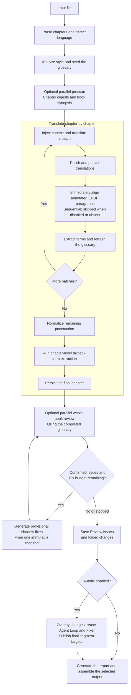

<div align="center">

# 📚 Wenyi

**Local CLI agents, especially Pi CLI, powering a complete book-translation workflow.**

Direct CLI invocation · Whole-book analysis · Real-time glossary · Multi-stage review

[](https://www.python.org/)
[](https://github.com/BigDawnGhost/wenyi/actions/workflows/tests.yml)
[](LICENSE)
[](https://github.com/BigDawnGhost/wenyi/stargazers)
[](https://discord.gg/sM3AQcF5D2)

**English** | [简体中文](docs/zh/README.md)


</div>

---

## Table of contents

- [Why Wenyi](#why-wenyi)
- [Core features](#core-features)
- [Quick start](#quick-start)
  - [Wenyi configuration](#wenyi-configuration-yaml-not-an-agents-native-config)
  - [Command syntax](#command-syntax-wenyi-vs-the-underlying-agent)
- [Supported formats](#supported-formats)
- [Translation pipeline](#translation-pipeline)
- [Documentation](#documentation)
- [Limitations](#limitations)
- [Community](#community)
- [Star history](#star-history)
- [License](#license)

---

## Why Wenyi

| Typical approach | Wenyi |
|---|---|
| Segments translated in isolation, unaware of surrounding content | Whole-book prescan with chapter digests and rolling context |
| Glossary managed manually or as an afterthought | Real-time term extraction with conflict detection, fed back into subsequent batches |
| Single-pass translation, fragile to interruptions | Batch checkpoints and chapter status tracking: resume any interrupted run with the same command |
| Raw model output, no systematic quality process | Translate → polish → evidence-driven whole-book review |

Wenyi is designed for **long-form texts** — novels, social-science monographs, narrative nonfiction, and more. Its primary workflow **directly invokes locally installed CLI agents, especially Pi CLI**, rather than requiring a separate HTTP API integration for every model. Wenyi handles parsing, context, terminology, translation, review, and export; the selected agent handles model access and authentication. Existing HTTP providers remain optional alternatives.

**Supported deployment: clone this repository and run it locally, with the corresponding CLI agents already installed and authenticated.**

---

## Core features

- **Whole-book understanding** — prescans the source before translation, creating per-chapter digests and a book-level synopsis injected into every batch
- **Real-time glossary** — extracts proper names, terms, and recurring expressions as translation progresses; detects conflicting translations and surfaces them for resolution
- **Multi-stage quality** — optional polishing (strong model) and an evidence-driven whole-book AI review
- **Resumability** — batch-level checkpoints, chapter status tracking, and atomic state writes; interrupt at any point and resume with the same command
- **CLI-agent-first model access** — Pi CLI (recommended), Codex, Claude Code (`provider: anthropic`), CodeBuddy Code, and Agy; existing HTTP providers remain available
- **Wenyi-specific YAML routing** — `llm_list` + `llm_priority`, three workflow tiers, and per-tier provider overrides
- **Native EPUB preservation** — writes translated text back into the original XHTML templates and attempts to preserve styles, images, TOC, and anchors
- **Bilingual output** — optional source-and-translation edition with visually subdued source text, including dark mode support

---

## Quick start

### Prerequisites: install and authenticate your CLI agents first

**The only supported deployment is cloning this repository and running the source locally.** Do not use a standalone executable, a hosted web service, or a package-only installation as the supported setup. Wenyi does not bundle, install, or log in to CLI agents for you.

Install Git, Python 3.10+, and [uv](https://docs.astral.sh/uv/), plus **every CLI agent used by your configuration**, including fallback entries and tier overrides. **Pi CLI is the recommended starting point**; Codex, Claude Code, CodeBuddy Code, and Agy are also integrated. Follow each agent's own installation and authentication instructions. The chosen models must already be available through that agent on this machine.

For Pi, check the executable in the same terminal/account that will run Wenyi:

```bash
pi --version
pi --help
```

Then complete Pi's login/provider/model setup and verify a small prompt directly with your chosen model. `--version` alone does not prove authentication or model access. Local execution does not mean offline inference: an agent may still contact its configured remote model service and consume quota.

### Installation from source

```bash
git clone https://github.com/BigDawnGhost/wenyi.git
cd wenyi
uv sync --locked
uv run trans-novel --help
```

Run the examples below from the repository root. If the executable is not on `PATH`, set `cli_path` to its actual local path. On Windows, a YAML path such as `'C:\Program Files\nodejs\pi.cmd'` must match your installation; do not copy another user's path from the repository configuration. In PowerShell, a quoted executable path is invoked with `&`, for example `& 'C:\Program Files\nodejs\pi.cmd' --version`.

### Wenyi configuration: YAML, not an agent's native config

`config.yaml` is **Wenyi's own configuration format**. It controls the workflow, provider routing, models, and tiers; it is not Pi's native model/authentication file, a Codex TOML file, or a shell command. Configure credentials and custom model registrations inside the corresponding CLI agent first.

The checked-in `config.yaml` contains machine-specific paths and model aliases. Edit it for your machine, or save the following minimal example as `config.local.yaml` and pass it explicitly. Replace every `YOUR_PROVIDER/YOUR_MODEL` with a model identifier accepted by your installed Pi CLI:

```yaml
language:
  source: auto
  target: zh

llm_priority: "0"
llm_list:
  - provider: pi
    cli_path: pi  # On PATH; or use the actual absolute executable path
    timeout: 600
    max_retries: 4
    tiers:
      strong:
        model: "YOUR_PROVIDER/YOUR_MODEL"
        options:
          thinking: true
          reasoning_effort: high
      cheap:
        model: "YOUR_PROVIDER/YOUR_MODEL"
        options:
          thinking: true
          reasoning_effort: medium
      fast:
        model: "YOUR_PROVIDER/YOUR_MODEL"
        options:
          thinking: false

pipeline:
  polish: true
  review: false

output:
  mono: true
  bilingual: false
```

- **`llm_list`** contains 1–10 complete provider configurations, indexed from **0**. Each entry has its own `provider`, `cli_path`, `timeout` (seconds), `max_retries`, and `tiers`.
- **`llm_priority`** must be a quoted string containing each entry's index exactly once. With three entries, `"021"` means entry 0 → entry 2 → entry 1, not model weights or tier names. With one entry use `"0"`; omission defaults to list order. Duplicate, missing, or out-of-range indices are invalid.
- **Switching is not generic failover:** the current multi-configuration scheduler switches on `PiAuditError`, not every timeout, login error, or provider failure. After 600 seconds without another recorded audit event, a subsequent request can restore the first-priority entry. All configured agents must be installed and usable before starting; fallback is not a substitute for setup.
- **`tiers.strong / cheap / fast`** are Wenyi workflow roles, not CLI subcommands or guaranteed price levels. `strong` handles analysis, body translation, and polishing; `cheap` is used for initial review and annotation alignment; `fast` is used for chapter/book summaries. Review Agent/Fixer selection also follows `pipeline.review_agent_tier`. Configure all three explicitly, even if they use the same model.
- **Pi options:** `model` is passed unchanged to `pi --model`; it can be a Pi-recognized model ID or `provider/model` selector. Wenyi's `provider: pi` selects the CLI adapter, not the underlying model vendor. `thinking: true` maps `reasoning_effort` to `--thinking`; `thinking: false` sends `--thinking off`. Use a level supported by your Pi version and model.
- **`cli_path` is only an executable path**, not `pi -p --model ...`. Omit it to discover the executable on `PATH`. With Pi, Codex, Claude Code, CodeBuddy, and Agy, authentication belongs to the CLI; Wenyi's `base_url` / `api_key_env` do not configure these CLI adapters. Existing HTTP providers remain available and use their own connection fields.
- **Single-configuration compatibility:** `llm: { ... }` is still accepted in place of a one-entry `llm_list`. Never define both `llm` and `llm_list` in the same YAML document.
- **Tier overrides:** inside any entry, a tier can override `provider`, `model`, `cli_path`, `base_url`, `api_key_env`, `reasoning_style`, and `options` as supported by that provider. Connection fields not overridden inherit from the entry. In particular, switching from Pi to another CLI does **not** clear an inherited Pi executable path: explicitly override `cli_path` too. Options are provider-specific, not arbitrary command-line flags.

For example, replace `strong` inside the Pi entry above to use Codex for that tier while keeping the other tiers on Pi:

```yaml
      strong:
        provider: codex
        cli_path: codex
        model: "YOUR_CODEX_MODEL"
        options:
          reasoning_effort: high
```

Other top-level sections include `segment`, `pipeline`, `honorific`, `punctuation`, `paths`, and `output`. See [configuration reference](docs/configuration.md) and the checked-in [configuration example](config.yaml). The default configuration path is `config.yaml` in the current working directory. A missing configuration file is automatically created from the built-in template; **that template is not a ready-authenticated Pi setup**—review it before continuing. Do not commit local credentials or private configuration.

### Command syntax: Wenyi vs. the underlying agent

Use this structure (angle brackets describe placeholders; do not type them):

```text
uv run trans-novel [--config <config-file> | -c <config-file>] <command> [arguments] [options]
```

**Global `--config/-c` goes before the subcommand.** Model selection belongs in YAML, not in a made-up `translate --model` argument. Quote file paths containing spaces.

```bash
uv run trans-novel -c config.local.yaml prepare "books/my book.epub"
uv run trans-novel -c config.local.yaml translate "books/my book.epub" --bilingual
uv run trans-novel -c config.local.yaml review "books/my book.epub"
uv run trans-novel -c config.local.yaml status "books/my book.epub"
uv run trans-novel translate --help
```

Use the same `-c` selection on later stages and resumed runs. Examples elsewhere in this README that omit `-c` use the default `config.yaml`.

Wenyi constructs the agent commands itself. These are **invocation shapes**, not configuration values or complete standalone translation commands; prompts and protocol input are supplied by the adapters:

| Wenyi `provider` | Installed agent | Invocation shape |
|---|---|---|
| `pi` | Pi CLI | `pi -p --mode json --model MODEL --thinking LEVEL ...` |
| `codex` | Codex CLI | `codex exec --json --model MODEL ... -` |
| `anthropic` | Claude Code CLI | `claude -p --output-format json --model MODEL ...` |
| `codebuddy` | CodeBuddy Code CLI | `codebuddy -p --output-format json --model MODEL ...` |
| `agy` | Agy CLI | `agy --print= --input-format stream-json --output-format stream-json --disable-slash-commands --model MODEL --effort LEVEL` |

For Pi, the adapter's command is equivalent to the following shape:

```text
pi -p --no-tools --no-session --no-extensions --no-context-files --no-skills --no-prompt-templates --mode json --model MODEL --thinking LEVEL [--system-prompt TEMP_FILE]
```

Wenyi sends the user text on stdin, uses a temporary file for a nonempty system prompt, and reads the final assistant text and usage from JSONL events. It deliberately disables Pi tools, extensions, skills, prompt templates, context-file discovery, and persistent sessions: **the CLI supplies model responses; Wenyi owns translation orchestration and saved state**. Agy instead receives structured stream-JSON input, so a plain-text pipe is not interchangeable with its protocol.

### One-command translation

```bash
uv run trans-novel translate book.epub
```

This parses the book, detects the source language, prescans for understanding, translates all chapters, and assembles the output. The monolingual Chinese EPUB is written to `output/book.zh.epub` by default.

### Step-by-step workflow

```bash
# 1. Prepare — parse, analyze, prescan (no body text translated)
uv run trans-novel prepare book.epub

# 2. Translate — resume from the prepared state
uv run trans-novel translate book.epub

# 3. Review — independent final review against the completed glossary
uv run trans-novel review book.epub

# 4. Check progress
uv run trans-novel status book.epub
```

### Interrupt and resume

Every completed batch is persisted immediately. If a run is interrupted, execute the same command again:

```bash
uv run trans-novel translate book.epub
```

### Command-line overrides

```bash
uv run trans-novel translate book.epub --polish --review          # enable polishing and final review
uv run trans-novel translate book.epub --no-polish                # disable polishing
uv run trans-novel translate book.epub --bilingual                # produce both editions
uv run trans-novel translate book.epub --chapter 0                # translate the first chapter (indices start at 0)
uv run trans-novel translate book.epub --format txt               # export as plain text
```

Final review is disabled by default. Set `pipeline.review: true` to run it
automatically after the complete book has been translated and the glossary has
reached its final state, or run Agent Review independently:

```bash
uv run trans-novel review book.epub
uv run trans-novel review book.epub --autofix
```

Each Review run starts from the beginning, checks chunks concurrently, and can
selectively request cross-book evidence before resolving contradictory
consistency suggestions. Confirmed issues can produce provisional full-segment
replacements in a run-local shadow translation. A fresh whole-book review sees
the shadow text—but not the previous issue explanation—and validates it again.
Review is read-only by default. With `--autofix` (or
`pipeline.review_autofix: true`), folded changes are applied first and remaining
issues reuse the existing Review Agent Loop and Fixer against that updated text.
Only formal segment `target` values are replaced; full history stays in the Review
directory's `autofix/index.json`. The consolidated result, run usage, events, and
internal records are written under `state/<book>/reviews/review-<timestamp>/`.

---

## Supported formats

| Input | Output |
|---|---|
| EPUB, FB2, TXT, Markdown, HTML, PDF, DOCX | EPUB (monolingual / bilingual), TXT, HTML, Markdown, DOCX |
| SRT (movie / series subtitles) | `.zh.srt` (monolingual) and optional `.zh-bi.srt` (bilingual) |

- PDF input requires `MINERU_API_KEY` for the initial conversion; the resulting HTML is cached and reused.
- EPUB output attempts to preserve the original book's styles, images, table of contents, and anchors. Vertical layout is converted to horizontal for Chinese reading.
- Source language is auto-detected by default, or fixed to an ISO 639-1 code in `config.yaml`.
- `.srt` input is auto-detected by `translate`. It uses a light concurrent path (no glossary, polish, or whole-book review). State lives under `state/srt/<slug>/`; outputs default to the source file's `output/` directory. Details: [Usage guide](docs/usage.md#srt-subtitles).
- `.docx` input uses the full book pipeline. Headings, simple tables, lists, and common run/paragraph styles are preserved where possible; translated Chinese uses Song (宋体). Default export is `.zh.docx` (override with `--format`). Details: [Usage guide](docs/usage.md#docx-word).

---

## Translation pipeline



When enabled, the prescan runs in parallel with configurable concurrency and is idempotent — completed digests are reused across runs. During translation, each batch receives the most recent glossary snapshot and translated context, keeping pronouns, terms, and tone consistent across chapters.
The Review Fixer receives the same style brief, book synopsis, chapter digest,
relevant glossary subset, and nearby source/translation context used to preserve
the book's voice. Its normal Review-loop replacements remain temporary; the
optional Autofix publisher can later reuse it to produce formal segment targets.

---

## Documentation

- [Usage guide](docs/usage.md) — installation, Windows setup, input/output, resumability, independent stages
- [Configuration](docs/configuration.md) — providers, languages, pipeline switches, segmentation, paths
- [Translation pipeline](docs/pipeline.md) — whole-book analysis, terminology, context, polishing, review
- [Contributing](CONTRIBUTING.md) — development, testing, and contribution guidelines

Translated state directories for public-domain books may be shared through [wenyi-bookcase](https://github.com/BigDawnGhost/wenyi-bookcase). Do not publish copyrighted text, private books, or `state/` directories containing sensitive information without permission.

---

## Limitations

- The translation pipeline is optimized for Simplified Chinese output; other target languages are not supported.
- Polishing and final review are the most expensive stages. Shadow fixing may
  trigger multiple full-book review passes and additional Fixer calls.
- PDF input depends on the MinerU external service; the initial conversion requires an API key.
- SRT translation is a light concurrent path: no glossary, polishing, or whole-book review, and slug collision is possible for identically named files in different folders.
- Translation quality is bounded by the capabilities of the chosen LLM model.
- Very long books may produce large state directories; storage requirements grow with book length.

---

## Community

- [Discord server](https://discord.gg/sM3AQcF5D2)
- QQ group: 1055065098
- [GitHub Issues](https://github.com/BigDawnGhost/wenyi/issues) — bug reports and feature requests
- [GitHub Discussions](https://github.com/BigDawnGhost/wenyi/discussions) — ideas and questions

---

## Star history

<a href="https://star-history.dera.page/#BigDawnGhost/wenyi&type=date&legend=top-left">
 <picture>
   <source media="(prefers-color-scheme: dark)" srcset="https://star-history.dera.page/svg?repos=BigDawnGhost/wenyi&type=date&theme=dark&legend=top-left" />
   <source media="(prefers-color-scheme: light)" srcset="https://star-history.dera.page/svg?repos=BigDawnGhost/wenyi&type=date&legend=top-left" />
   
 </picture>
</a>

---

## License

[MIT](LICENSE)

---

## AtomGit (China)

Wenyi is also hosted on AtomGit: [https://atomgit.com/BigDawnGhost/wenyi](https://atomgit.com/BigDawnGhost/wenyi)
