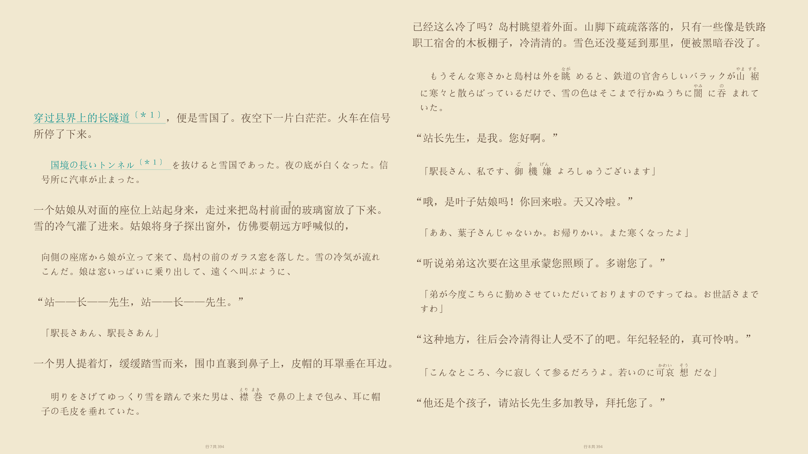
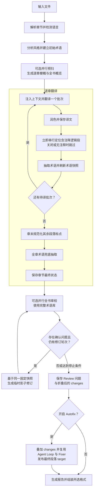

<div align="center">

# 📚 文译

**直接调用本地 CLI Agent，尤其是 Pi CLI，完成整本书的翻译工作流。**

直接调用 CLI · 全书预扫 · 实时术语闭环 · 多阶段审校

[](https://www.python.org/)
[](https://github.com/BigDawnGhost/wenyi/actions/workflows/tests.yml)
[](../../LICENSE)
[](https://github.com/BigDawnGhost/wenyi/stargazers)
[](https://discord.gg/sM3AQcF5D2)

[English](../../README.md) | **简体中文**



</div>

---

## 目录

- [为什么选择文译](#为什么选择文译)
- [核心特性](#核心特性)
- [快速开始](#快速开始)
  - [本项目专用配置格式](#本项目专用配置格式yaml不是-agent-原生配置)
  - [命令格式](#命令格式区分-wenyi-命令和底层-agent-命令)
- [支持格式](#支持格式)
- [翻译流水线](#翻译流水线)
- [文档](#文档)
- [憧憬与不足](#憧憬与不足)
- [社区](#社区)
- [星标历史](#星标历史)
- [许可证](#许可证)

---

## 为什么选择文译

| 常见方案 | 文译 |
|---|---|
| 逐段翻译，彼此孤立，缺乏上下文 | 全书预扫 + 逐章梗概 + 滚动上下文 |
| 术语靠人工事后整理 | 翻译中实时抽取专有名词，自动检测译法冲突，立即影响后续批次 |
| 一次性翻译，中断即作废 | 批次检查点 + 章节状态记录，任意中断后重新执行同一命令即可续跑 |
| 模型直出，无系统性质控 | 翻译 → 润色 → 取证式全书审校 |

文译为**长文本**设计 —— 长篇小说、社科专著、纪实文学……主打**直接调用本机安装的各种 CLI Agent，尤其是 Pi CLI**，而不是要求每个模型都单独配置一套 HTTP API 接入。Wenyi 负责解析、上下文、术语、翻译、审校和导出，所选 Agent 负责模型访问与鉴权；已有 HTTP provider 仍作为可选接入方式保留。

**仅支持拉取本仓库后本地运行，使用前必须安装并登录配置所对应的 CLI Agent。**

---

## 核心特性

- **全书理解** — 翻译前预扫源文，生成逐章梗概和全书概览，注入每批翻译上下文
- **实时术语闭环** — 翻译中自动提取人名、地名、术语和固定表达；检测译法冲突并提示人工裁决
- **多阶段质量保证** — 可选润色（强档模型重译）和取证式全书 AI 审校
- **断点续跑** — 批次级检查点、章节状态记录和原子状态写入；任意中断后重新执行同一命令即可续跑
- **CLI Agent 优先接入** — Pi CLI（推荐）、Codex、Claude Code（`provider: anthropic`）、CodeBuddy Code、Agy；同时保留已有 HTTP provider
- **本项目专用 YAML 路由** — `llm_list` + `llm_priority`、三档流程角色与按档位覆盖 provider
- **原生 EPUB 回填** — 基于原书 XHTML 模板替换译文片段，尽量保留原书样式、图片、目录和锚点
- **双语对照输出** — 可选原文译文对照版，原文视觉淡化，支持深色模式

---

## 快速开始

### 环境要求：先安装并登录对应的 CLI Agent

**本项目只支持拉取仓库源码后，在本机运行。** 独立可执行文件、托管网页服务或仅安装发布包，都不是本项目支持的部署方式。Wenyi 不会替你安装 CLI Agent，也不会代为完成登录。

请先安装 Git、Python 3.10+、[uv](https://docs.astral.sh/uv/)，以及**配置中实际使用的全部 CLI Agent**，包括备用配置与档位覆盖所用的 Agent。**推荐优先使用 Pi CLI**；项目也集成了 Codex、Claude Code、CodeBuddy Code 和 Agy。各 Agent 的安装、登录及模型接入请按其自身文档完成，并确保所选模型在当前机器上可用。

以 Pi 为例，在后续运行 Wenyi 的同一个终端、同一个用户账号下检查：

```bash
pi --version
pi --help
```

然后完成 Pi 自身的登录、provider 与模型配置，并用所选模型直接执行一次简单提示词，确认可以得到回复。`--version` 成功只代表程序可运行，不代表登录和模型访问已成功。本地运行不等于离线推理：CLI 仍可能请求其配置的远程模型服务，并消耗额度。

### 从仓库安装

```bash
git clone https://github.com/BigDawnGhost/wenyi.git
cd wenyi
uv sync --locked
uv run trans-novel --help
```

下文命令均在仓库根目录执行。可执行文件不在 `PATH` 中时，用 `cli_path` 指定本机真实路径。Windows YAML 示例路径为 `'C:\Program Files\nodejs\pi.cmd'`，请按实际安装位置修改，不要照抄仓库配置中其他用户的路径。PowerShell 调用带空格的可执行文件路径时使用 `&`，例如 `& 'C:\Program Files\nodejs\pi.cmd' --version`。

### 本项目专用配置格式：YAML，不是 Agent 原生配置

`config.yaml` 使用的是 **Wenyi 自己的配置结构**，负责流程开关、provider 路由、模型与档位。它不是 Pi 原生模型/鉴权文件，不是 Codex 的 TOML，也不是一条 Shell 命令。请先在对应 CLI Agent 中完成凭据与自定义模型注册。

仓库中的 `config.yaml` 含有特定机器的路径和模型别名，不能直接假定在你本机可用。可以按需修改它，或将下面的最小示例保存为 `config.local.yaml` 并显式指定。所有 `YOUR_PROVIDER/YOUR_MODEL` 都必须替换成你安装的 Pi CLI 能识别、能访问的模型标识：

```yaml
language:
  source: auto
  target: zh

llm_priority: "0"
llm_list:
  - provider: pi
    cli_path: pi  # 从 PATH 调用；也可以填写真实的绝对路径
    timeout: 600
    max_retries: 4
    tiers:
      strong:
        model: "YOUR_PROVIDER/YOUR_MODEL"
        options:
          thinking: true
          reasoning_effort: high
      cheap:
        model: "YOUR_PROVIDER/YOUR_MODEL"
        options:
          thinking: true
          reasoning_effort: medium
      fast:
        model: "YOUR_PROVIDER/YOUR_MODEL"
        options:
          thinking: false

pipeline:
  polish: true
  review: false

output:
  mono: true
  bilingual: false
```

- **`llm_list`**：1–10 项完整的 provider 配置，按列表位置从 **0** 编号。每项独立设置 `provider`、`cli_path`、`timeout`（秒）、`max_retries` 与 `tiers`。
- **`llm_priority`**：必须是带引号的字符串，且每个配置索引恰好出现一次。三项配置时，`"021"` 表示先用第 0 项，再到第 2 项、最后第 1 项；不是模型权重，也不是档位名。单项写 `"0"`，省略则按列表顺序生成。重复、遗漏或越界索引均不合法。
- **不是通用故障切换**：当前多配置调度器针对 `PiAuditError` 自动切换，并非所有超时、登录错误或 provider 失败都会切换。距上次记录的审计事件满 600 秒后，后续请求可以恢复首选配置。启动前应确保全部配置使用的 Agent 已安装且可用，不能依靠备用项来代替环境配置。
- **`tiers.strong / cheap / fast`**：是 Wenyi 的流程角色，不是 CLI 子命令，也不保证真实价格高低。`strong` 用于分析、正文翻译和润色；`cheap` 用于初审、注释对齐；`fast` 用于章节梗概、全书概要。Review Agent/Fixer 还受 `pipeline.review_agent_tier` 控制。建议显式填写三档，即使全部使用同一个模型。
- **Pi 选项映射**：`model` 原样传给 `pi --model`，可以是 Pi 能识别的模型 ID 或 `provider/model` 选择器。Wenyi 的 `provider: pi` 选中的是 CLI 适配器，不是底层模型厂商。`thinking: true` 将 `reasoning_effort` 传给 `--thinking`；`thinking: false` 则发送 `--thinking off`。思考档位必须由你本机的 Pi 版本与模型支持。
- **`cli_path` 只填可执行文件路径**，不要填 `pi -p --model ...` 整条命令。省略时从 `PATH` 查找。Pi、Codex、Claude Code、CodeBuddy、Agy 的鉴权由对应 CLI 自身负责，Wenyi 的 `base_url` / `api_key_env` 不用于配置这些 CLI 适配器。原有 HTTP provider 仍可使用，并按各自规则读取连接字段。
- **单配置兼容写法**：仍支持用 `llm: { ... }` 代替仅含一项的 `llm_list`，但同一份 YAML 不能同时定义 `llm` 和 `llm_list`。
- **按档位覆盖**：每项配置内部的 tier 可以按 provider 支持情况覆盖 `provider`、`model`、`cli_path`、`base_url`、`api_key_env`、`reasoning_style` 与 `options`。未覆盖的连接字段继承该列表项。尤其注意：从 Pi 切换为其他 CLI **不会自动清除继承的 Pi 路径**，必须同时显式覆盖 `cli_path`。`options` 是 provider 专属选项，不是任意命令行参数透传。

例如，在上面的 Pi 配置项中替换 `strong`，让该档使用 Codex，其余档仍使用 Pi：

```yaml
      strong:
        provider: codex
        cli_path: codex
        model: "YOUR_CODEX_MODEL"
        options:
          reasoning_effort: high
```

其他顶层配置块包括 `segment`、`pipeline`、`honorific`、`punctuation`、`paths`、`output`，详见[配置说明](configuration.md)与[仓库配置示例](../../config.yaml)。默认读取当前工作目录的 `config.yaml`。配置文件不存在时会自动创建内置模板，但**自动生成不等于已经配好 Pi 或完成登录**，请先检查内容。不要提交本地凭据或私有配置。

### 命令格式：区分 Wenyi 命令和底层 Agent 命令

统一结构如下（尖括号表示占位说明，不要原样输入）：

```text
uv run trans-novel [--config <配置文件> | -c <配置文件>] <子命令> [位置参数] [选项]
```

**全局参数 `--config/-c` 放在子命令前。** 模型在 YAML 中选择，不要编造 `translate --model` 参数。带空格的文件路径必须加引号。

```bash
uv run trans-novel -c config.local.yaml prepare "books/my book.epub"
uv run trans-novel -c config.local.yaml translate "books/my book.epub" --bilingual
uv run trans-novel -c config.local.yaml review "books/my book.epub"
uv run trans-novel -c config.local.yaml status "books/my book.epub"
uv run trans-novel translate --help
```

后续阶段和断点续跑应使用同一份 `-c` 配置。本文其他省略 `-c` 的示例均使用默认 `config.yaml`。

Wenyi 会自行组装底层 Agent 命令。下表是**调用形态**，不是配置字段，也不是可独立完成翻译的完整命令；提示词及协议输入由适配器提供：

| Wenyi `provider` | 本机需要安装的 Agent | 调用形态 |
|---|---|---|
| `pi` | Pi CLI | `pi -p --mode json --model MODEL --thinking LEVEL ...` |
| `codex` | Codex CLI | `codex exec --json --model MODEL ... -` |
| `anthropic` | Claude Code CLI | `claude -p --output-format json --model MODEL ...` |
| `codebuddy` | CodeBuddy Code CLI | `codebuddy -p --output-format json --model MODEL ...` |
| `agy` | Agy CLI | `agy --print= --input-format stream-json --output-format stream-json --disable-slash-commands --model MODEL --effort LEVEL` |

Pi 适配器实际组装的命令形态如下：

```text
pi -p --no-tools --no-session --no-extensions --no-context-files --no-skills --no-prompt-templates --mode json --model MODEL --thinking LEVEL [--system-prompt TEMP_FILE]
```

Wenyi 从 stdin 传入用户文本，有系统提示词时通过临时文件传入，再从 JSONL 事件流提取最终回复与用量。它会关闭 Pi 的工具、扩展、技能、提示词模板、上下文文件发现和会话持久化：**CLI 负责返回模型结果，Wenyi 负责编排翻译并保存运行状态**。Agy 则使用结构化 stream-JSON 输入，不能把普通文本管道当作同一协议直接替换。

### 一键翻译

```bash
uv run trans-novel translate book.epub
```

解析书籍、检测源语言、预扫全书、翻译所有章节、组装输出，一步完成。默认在 `output/` 目录生成单语中文版 `book.zh.epub`。

### 分步工作流

```bash
# 1. 译前准备 — 解析、分析、预扫（不翻译正文）
uv run trans-novel prepare book.epub

# 2. 翻译 — 从准备状态续跑
uv run trans-novel translate book.epub

# 3. 独立审校 — 基于最终术语库的逐章审校
uv run trans-novel review book.epub

# 4. 查看进度
uv run trans-novel status book.epub
```

### 中断续跑

每个完成的批次立即持久化。中断后重新执行同一命令即可续跑：

```bash
uv run trans-novel translate book.epub
```

### 命令行覆盖

```bash
uv run trans-novel translate book.epub --polish --review          # 开启润色和最终审校
uv run trans-novel translate book.epub --no-polish                # 关闭润色
uv run trans-novel translate book.epub --bilingual                # 同时生成双语版
uv run trans-novel translate book.epub --chapter 0                # 仅翻译第一章（索引从 0 开始）
uv run trans-novel translate book.epub --format txt               # 导出为纯文本
```

最终审校默认关闭。设置 `pipeline.review: true` 后，一键流程会在全书翻译完成、
术语库达到最终状态后再统一执行审校；也可以独立运行 Agent Review：

```bash
uv run trans-novel review book.epub
uv run trans-novel review book.epub --autofix
```

每次 Review 都会从头全量运行，并发检查文本块，并可按需获取跨章证据后处理互相
矛盾的一致性建议。确认的问题可生成仅限本次运行的完整单段影子修订；下一轮从头盲审
只会看到影子译文，不会收到上一轮的问题说明。Review 默认只读；使用 `--autofix`
（或设置 `pipeline.review_autofix: true`）后，会先应用折叠后的 changes，再让剩余
issues 基于更新译文复用现有 Review Agent Loop 和 Fixer。只有正式段落的 `target`
会被覆盖，完整历史保存在 Review 目录的 `autofix/index.json`；统一结果仍写入
`state/<书名>/reviews/review-<时间戳>/result.json`。

---

## 支持格式

| 输入 | 输出 |
|---|---|
| EPUB、FB2、TXT、Markdown、HTML、PDF、DOCX | EPUB（单语 / 双语）、TXT、HTML、Markdown、DOCX |
| SRT（影视字幕） | 单语 `.zh.srt`，可选双语 `.zh-bi.srt` |

- PDF 输入首次需 `MINERU_API_KEY` 调用外部转换服务，转换后的 HTML 缓存复用。
- EPUB 输出尽量保留原书样式、图片、目录和锚点，竖排转为横排以适配中文阅读。
- 源语言默认由模型自动识别，也可在 `config.yaml` 中固定为 ISO 639-1 语言代码。
- `.srt` 由 `translate` 自动识别，走轻量并发路径（无术语库、润色与全书审校）。状态在 `state/srt/<slug>/`，成品默认写到源文件旁的 `output/`。详见[使用指南](usage.md#srt-字幕)。
- `.docx` 走完整书籍管线：尽量保留标题导航、简易表格、列表与常见字符/段落样式；已译中文用宋体。默认导出 `.zh.docx`（可用 `--format` 覆盖）。详见[使用指南](usage.md#docx-word)。

---

## 翻译流水线



启用全书理解时，预扫阶段按可配置并发数并行执行，并且幂等可续跑——已完成的梗概会跨运行复用。翻译过程中，每批获得最新的术语快照和已译上下文，确保代词、术语和语气跨章一致。
Review Fixer 同样会获得风格指南、全书概览、本章梗概、相关术语及邻近原译文，
以保持全书风格；普通 Review 循环中的替换只存在于影子译文中，可选 Autofix 发布
阶段会复用它生成正式段落 target。

---

## 文档

- [使用指南](usage.md) — 安装、Windows 使用、输入输出、断点续跑和独立工作流阶段
- [配置说明](configuration.md) — 模型提供商、源语言、流水线开关、切分与路径配置
- [翻译流程](pipeline.md) — 预扫、术语、上下文、润色、审校和断点续跑如何协作
- [贡献指南](CONTRIBUTING.md) — 开发、测试和贡献要求

公版书翻译生成的状态目录可在 [wenyi-bookcase](https://github.com/BigDawnGhost/wenyi-bookcase) 查看，也欢迎提交分享。请勿提交或分享无授权的版权文本、私人书籍或包含敏感信息的 `state/` 目录。

---

## 憧憬与不足

本项目为作者个人兴趣所开发，旨在为长文本书籍的译介做出一份微薄的努力。现阶段翻译质量仍受限于所选模型的能力：润色和审校阶段会显著增加 token 消耗，开启影子修订后还可能执行多次全书审校与额外 Fixer 调用；极长的书籍可能产生较大的状态目录，PDF 输入依赖外部 MinerU 服务。SRT 字幕走轻量并发路径，不建术语库、不做润色与全书审校，不同目录下同名文件也可能共用同一 `state/srt/<slug>/`。当前译文管线主要针对简体中文输出优化，不支持其他目标语言。

未来想让翻译在够准确的前提下更加顺畅，努力从可读向好读迈进。如果你发现了问题，欢迎提交 [Issue](https://github.com/BigDawnGhost/wenyi/issues)；如果你有想法，欢迎在[讨论区](https://github.com/BigDawnGhost/wenyi/discussions)提出；如果你有一定的编程能力，欢迎提交 PR，让这个项目变得更好。👏

---

## 社区

- [Discord 服务器](https://discord.gg/sM3AQcF5D2)
- QQ 群：1055065098
- [GitHub Issues](https://github.com/BigDawnGhost/wenyi/issues) — 问题反馈
- [GitHub Discussions](https://github.com/BigDawnGhost/wenyi/discussions) — 想法与讨论

---

## 星标历史

<a href="https://star-history.dera.page/#BigDawnGhost/wenyi&type=date&legend=top-left">
 <picture>
   <source media="(prefers-color-scheme: dark)" srcset="https://star-history.dera.page/svg?repos=BigDawnGhost/wenyi&type=date&theme=dark&legend=top-left" />
   <source media="(prefers-color-scheme: light)" srcset="https://star-history.dera.page/svg?repos=BigDawnGhost/wenyi&type=date&legend=top-left" />
   
 </picture>
</a>

---

## 许可证

[MIT](../../LICENSE)

---

## 国内 AtomGit 托管

本项目在 AtomGit 亦有镜像：[https://atomgit.com/BigDawnGhost/wenyi](https://atomgit.com/BigDawnGhost/wenyi)
